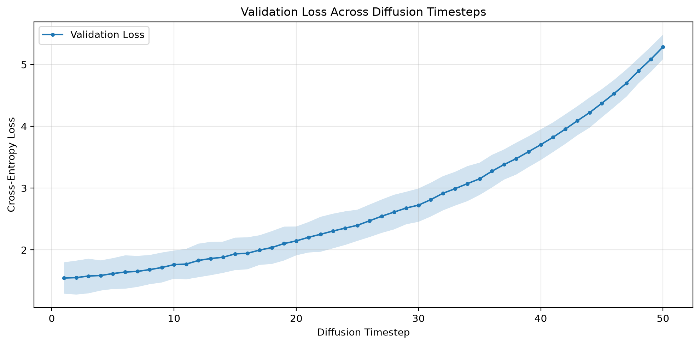
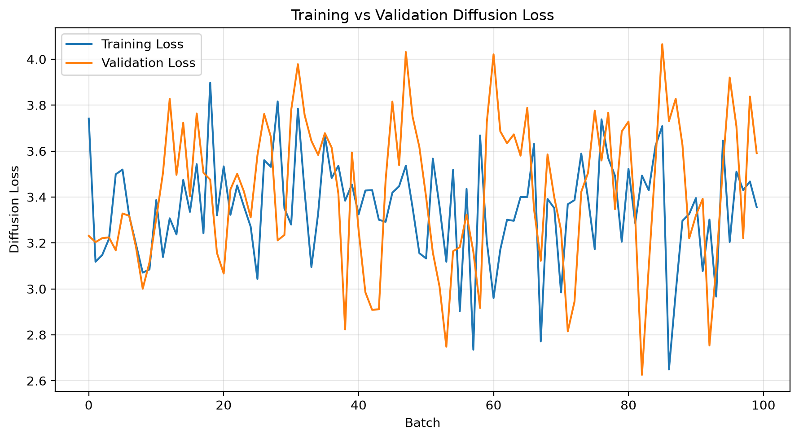
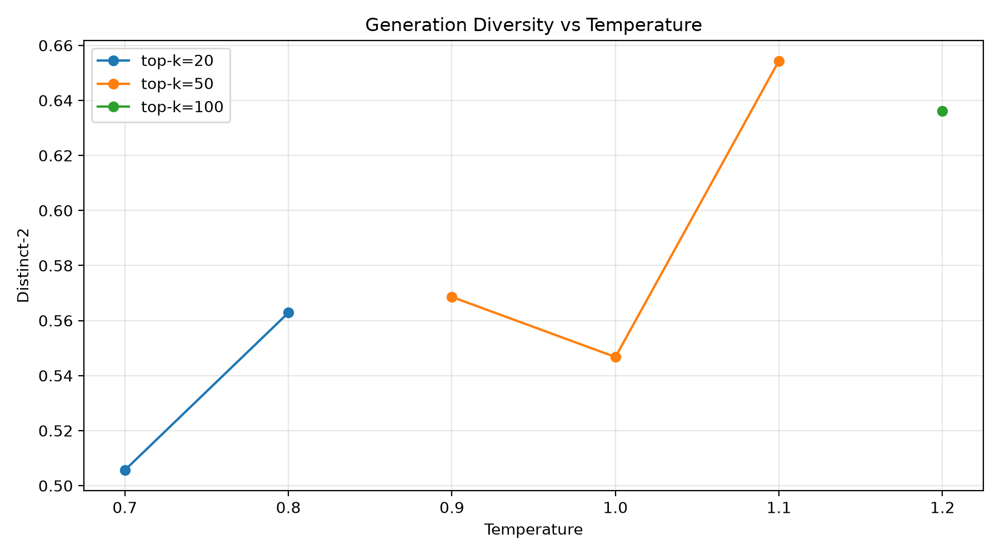
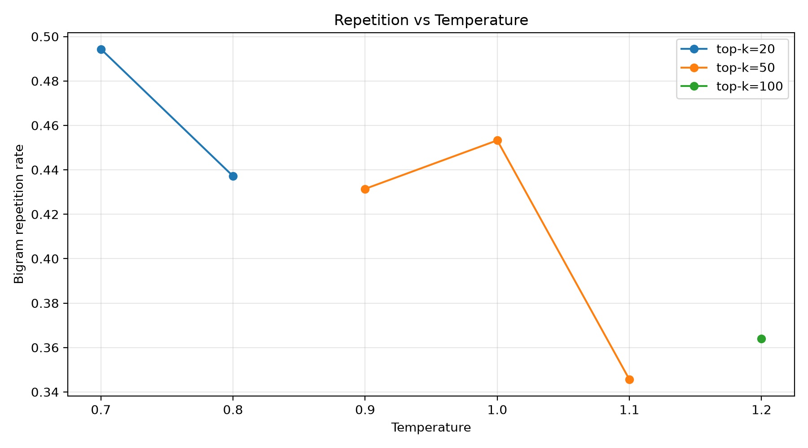
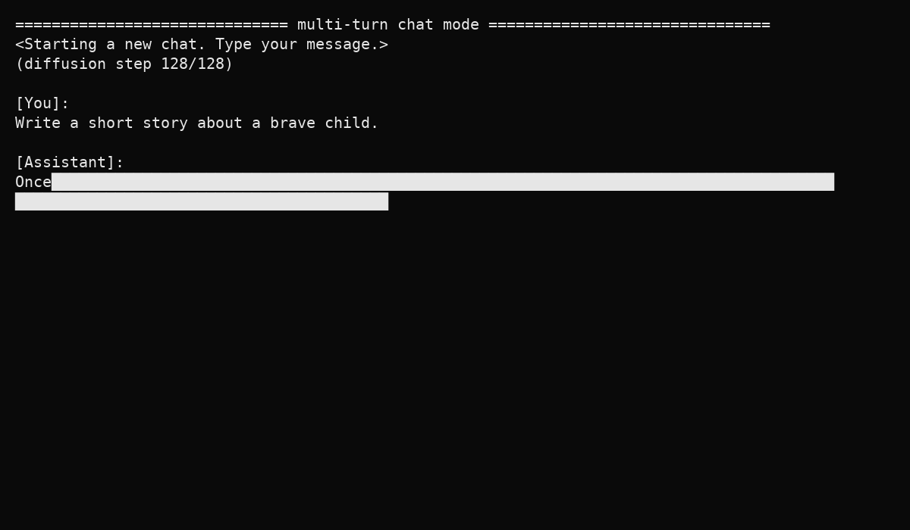

# Diffusion Language Model from Scratch

A small **diffusion language model (DLM) built from first principles** on the TinyStories corpus.

Instead of using an autoregressive next-token objective, this project trains a bidirectional Transformer to reconstruct tokens corrupted by progressively stronger masking. Generation starts with a masked answer region and repeatedly samples, scores, and re-masks tokens until the sequence is fully denoised.

> **Experiment:** 1-hour RTX 4090 run · TinyStories · 50,000 optimizer steps · ~45.0M parameters

## What was built

The project implements the complete pipeline:

1. Dataset preparation from `roneneldan/TinyStories`.
2. Byte-level BPE tokenizer trained from scratch — no pretrained tokenizer.
3. Bidirectional Transformer with token, position, and diffusion-timestep embeddings.
4. Mask-based diffusion corruption with a linear mask-ratio schedule.
5. Masked-token cross-entropy objective — loss is computed only where tokens were corrupted.
6. Diffusion sampling through progressive unmasking and confidence-based re-masking.
7. Temperature / top-k sampling experiments.
8. Timestep-wise validation analysis.
9. Generation diversity and repetition metrics.
10. Progressive denoising visualization as a terminal-style GIF.

The repository is deliberately organized around the underlying mechanisms rather than a notebook dump.

## Architecture

```text
                    ┌─────────────────────────┐
                    │       TinyStories       │
                    └────────────┬────────────┘
                                 │
                                 ▼
                    ┌─────────────────────────┐
                    │ Byte-level BPE tokenizer│
                    │     trained from scratch │
                    └────────────┬────────────┘
                                 │
                                 ▼
                        clean token sequence x₀
                                 │
                                 ▼
                 ┌──────────────────────────────┐
                 │ Diffusion corruption q(xₜ|x₀)│
                 │ mask ratio = t / T          │
                 └──────────────┬───────────────┘
                                │
                                ▼
                       masked sequence xₜ
                                │
                                ▼
              ┌──────────────────────────────────┐
              │      Bidirectional Transformer   │
              │ token + position + timestep emb. │
              │ 10 × TransformerEncoder blocks   │
              │        GELU / LayerNorm          │
              └────────────────┬─────────────────┘
                               │
                               ▼
                         vocabulary logits
                               │
                               ▼
                cross-entropy on masked positions
```

### Generation

```text
prompt ──► fixed tokens
             │
             ▼
       [MASK] [MASK] ... [MASK]
             │
       diffusion step T
             ▼
       sample + confidence
             │
       keep confident tokens
       re-mask uncertain tokens
             │
             ▼
          repeat
             │
             ▼
        decoded text
```

## Model configuration

| Component | Value |
|---|---:|
| Dataset | TinyStories |
| Training examples | 1,000,000 configured |
| Validation examples | 10,000 configured |
| Tokenizer training examples | 150,000 |
| Vocabulary size | 26,000 |
| Sequence length | 256 |
| Embedding dimension | 512 |
| Transformer layers | 10 |
| Attention heads | 8 |
| Feed-forward dimension | 2,048 |
| Dropout | 0.1 |
| Diffusion steps | 128 |
| Parameters | ~45.0M |
| Optimizer | AdamW |
| Learning rate | 2e-4 |
| Weight decay | 0.1 |
| Warmup | 1,000 steps |
| Batch size | 32 |
| Gradient accumulation | 2 |
| Scheduler | cosine with warmup |
| Gradient clipping | 1.0 |
| Training budget | 55-minute safety cap |
| Completed steps | 50,000 |
| Recorded training time | ~42.5 minutes |

## Results

### Validation loss across diffusion timesteps

The timestep experiment shows a strong relationship between corruption severity and reconstruction difficulty. The lowest measured validation loss was **1.5457 at timestep 1**, while the highest was **5.2850 at timestep 50**.



### Training vs validation loss



The batch-level losses are noisy because each diffusion-loss evaluation samples a random timestep and mask pattern.

### Sampling diversity vs temperature



The tested **temperature 1.1 / top-k 50** configuration produced the highest recorded Distinct-2 score: **0.6544**.

### Repetition vs temperature



The same **temperature 1.1 / top-k 50** configuration produced the lowest recorded bigram repetition rate: **0.3456**.

### Progressive denoising

The generation process is explicitly iterative: the answer region begins masked and is progressively resolved over diffusion steps.



## Generation examples

The baseline experiment used 5 prompts, 128 generated tokens, 50 diffusion sampling steps, temperature 1.0, and top-k 50. Complete recorded outputs and metrics are in `results/data/baseline_generation_results.csv`.

A notable limitation is repetition and simple TinyStories-style continuation, consistent with the small model, limited compute budget, and TinyStories training distribution. This is an experimental baseline rather than a production-quality language model.

## Reproducibility

```bash
python -m venv .venv
# Windows: .venv\Scripts\activate
# Linux/macOS: source .venv/bin/activate
pip install -r requirements.txt
```

Train the tokenizer:

```bash
python scripts/train_tokenizer.py
```

Train the diffusion LM:

```bash
python scripts/train.py --config configs/one_hour_4090.json
```

Generate text after training:

```bash
python scripts/generate.py --checkpoint checkpoints/final/model.pt --tokenizer tokenizer_from_scratch/tokenizer.json --prompt "Explain neural networks in simple terms."
```

Run experiments:

```bash
python scripts/evaluate.py
python scripts/analyze_timestep.py
python scripts/analyze_sampling.py
```

## Repository structure

```text
diffusion-language-model-from-scratch/
├── README.md
├── requirements.txt
├── pyproject.toml
├── .gitignore
├── configs/
│   └── one_hour_4090.json
├── src/diffusion_lm/
│   ├── __init__.py
│   ├── config.py
│   ├── tokenizer.py
│   ├── data.py
│   ├── model.py
│   ├── diffusion.py
│   ├── generation.py
│   ├── metrics.py
│   └── visualization.py
├── scripts/
│   ├── train_tokenizer.py
│   ├── train.py
│   ├── generate.py
│   ├── evaluate.py
│   ├── analyze_timestep.py
│   ├── analyze_training_loss.py
│   ├── analyze_sampling.py
│   └── render_inference.py
├── tokenizer_from_scratch/tokenizer.json
├── results/data/
│   ├── baseline_generation_results.csv
│   └── sampling_results.csv
├── results/plots/
│   ├── loss_vs_diffusion_timestep.png
│   ├── training_validation_loss.png
│   ├── diversity_vs_temperature.png
│   ├── repetition_vs_temperature.png
│   └── diffusion_denoising_curve.png
└── assets/inference.gif
```

## Checkpoints

The trained `model.pt` is approximately **180 MB** and is intentionally not committed to normal Git history because GitHub's standard file-size limit is 100 MB. Checkpoint metadata is included; the full weights can be hosted separately using an artifact host or Git LFS.

## Design choices

### Bidirectional Transformer

Autoregressive language models restrict each token to information from the left context. Diffusion language modeling reconstructs masked tokens from the surrounding corrupted sequence, making bidirectional context natural for the denoising objective.

### Tokenizer from scratch

Using a pretrained tokenizer would hide an important part of the language-model pipeline. Training the byte-level BPE tokenizer locally makes tokenization explicit and reproducible.

### Mask-based diffusion

This implementation uses discrete corruption: tokens are progressively replaced by a mask token. The model learns to infer the clean token distribution from partially observed sequences.

### Temperature and top-k experiments

Temperature controls distribution sharpness while top-k restricts sampling to the most likely candidates. Repetition and Distinct-2 quantify the resulting sampling trade-off.

## Limitations

- TinyStories is small and stylistically narrow.
- The model is ~45M parameters.
- Training was constrained to roughly one hour on an RTX 4090.
- Generation quality is not comparable with modern production LLMs.
- Recorded loss curves are batch-level and noisy.
- Diversity and repetition metrics do not measure factuality, coherence, or instruction following.

## License

MIT
